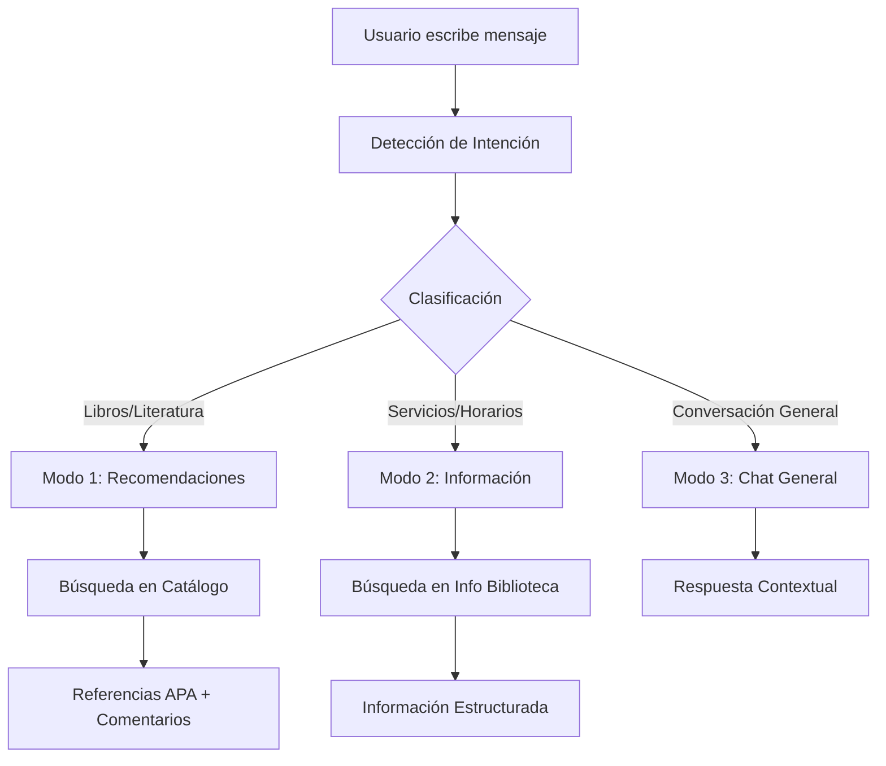

# LaIABot: Agente de IA Especializado en Recomendaciones Bibliotecarias

<div align="center">


[](https://python.org)
[](https://flask.palletsprojects.com)
[](https://sqlite.org)
[](LICENSE)

**Sistema especializado de inteligencia artificial para recomendaciones bibliotecarias personalizadas y asistencia en servicios de información documentales**

</div>

---

## 📋 Tabla de Contenidos

- [Descripción General](#-descripción-general)
- [Características Principales](#-características-principales)
- [Destinatarios y Casos de Uso](#-destinatarios-y-casos-de-uso)
- [Arquitectura del Sistema](#️-arquitectura-del-sistema)
- [Requisitos y Dependencias](#-requisitos-y-dependencias)
- [Instalación y Configuración](#-instalación-y-configuración)
- [Flujos Conversacionales](#-flujos-conversacionales)
- [Futuras Líneas de Desarrollo](#-futuras-líneas-de-desarrollo)
- [Autoría y Créditos](#-autoría-y-créditos)
- [Licencia](#-licencia)
- [Soporte y Contacto](#-soporte-y-contacto)

---

## 🔍 Descripción General

LaIABot es un sistema especializado de inteligencia artificial diseñado para proporcionar recomendaciones bibliotecarias personalizadas y asistencia en servicios de información documentales. Desarrollado desde una perspectiva académica en **Biblioteconomía y Documentación**, este agente conversacional integra técnicas avanzadas de procesamiento de lenguaje natural con metodologías tradicionales de gestión bibliotecaria.

El sistema emplea un enfoque híbrido que combina la potencia de los modelos de lenguaje grandes (LLM) con bases de datos estructuradas especializadas en catalogación bibliográfica, permitiendo ofrecer recomendaciones precisas, contextualmente relevantes y académicamente rigurosas.

---

## ✨ Características Principales

### 🔍 Sistema de Recomendación Inteligente
- **Detección automática de intenciones**: Clasificación en tiempo real de consultas de usuarios
- **Búsqueda híbrida FTS5+LIKE**: Optimización de recuperación de información bibliográfica
- **Recomendaciones contextualizadas**: Generación de sugerencias basadas en preferencias específicas
- **Referencias en formato APA**: Cumplimiento de estándares académicos de citación

### 🗄️ Gestión Integral de Colecciones
- **Catalogación automatizada**: Sistema de metadatos bibliográficos completo
- **Indexación semántica**: Búsqueda de texto completo optimizada con SQLite FTS5
- **Enlaces permanentes**: URLs estables para recursos bibliográficos
- **Taxonomías flexibles**: Sistema de etiquetado y clasificación temática

### 💬 Interfaz Conversacional Avanzada
- **Modos de funcionamiento diferenciados**: Recomendaciones, información de servicios y conversación general
- **Contexto persistente**: Mantenimiento del historial conversacional
- **Auto-expansión inteligente**: Adaptación dinámica de la interfaz según el contenido
- **Accesibilidad optimizada**: Cumplimiento de estándares WCAG

### 🛠️ Panel de Administración Completo
- **Gestión de catálogo bibliográfico**: CRUD completo para recursos documentales
- **Configuración de prompts**: Personalización de comportamientos del agente
- **Monitorización de conversaciones**: Análisis de interacciones y métricas de uso
- **Panel de estadísticas**: Dashboard con indicadores de rendimiento del sistema

---

## 🎯 Destinatarios y Casos de Uso

<details>
<summary><strong>Instituciones Académicas</strong></summary>

- Bibliotecas universitarias y de investigación
- Centros de documentación especializada
- Servicios de referencia académica

</details>

<details>
<summary><strong>Profesionales de la Información</strong></summary>

- Bibliotecarios y documentalistas
- Especialistas en sistemas de información
- Investigadores en recuperación de información

</details>

<details>
<summary><strong>Usuarios Finales</strong></summary>

- Estudiantes universitarios y de posgrado
- Investigadores y académicos
- Usuarios de servicios bibliotecarios

</details>

---

## 🏗️ Arquitectura del Sistema

### Modos de Funcionamiento



### Bases de Datos

| Base de Datos | Propósito | Tablas Principales |
|---------------|-----------|-------------------|
| `catalog.db` | Catálogo Bibliográfico | `collection`, `collection_fts` |
| `chatbot.db` | Sistema Conversacional | `threads`, `comments`, `prompts`, `users` |
| `ourlibrary.db` | Servicios Bibliotecarios | `infolib`, `infolib_fts` |

<details>
<summary><strong>Ver esquemas de base de datos</strong></summary>

#### catalog.db - Catálogo Bibliográfico
```sql
CREATE TABLE collection (
    id INTEGER PRIMARY KEY AUTOINCREMENT,
    dateregistry DATETIME DEFAULT CURRENT_TIMESTAMP,
    hash TEXT UNIQUE,
    permalink TEXT,
    title TEXT NOT NULL,
    author TEXT NOT NULL,
    publisher TEXT,
    year INTEGER,
    abstract TEXT,
    tags TEXT,
    indexer TEXT
);
```

#### chatbot.db - Sistema Conversacional
```sql
CREATE TABLE threads (
    id INTEGER PRIMARY KEY AUTOINCREMENT,
    dateregistry DATETIME DEFAULT CURRENT_TIMESTAMP,
    title TEXT DEFAULT 'Nueva conversación',
    mode INTEGER DEFAULT 1,
    status TEXT DEFAULT 'active'
);

CREATE TABLE comments (
    id INTEGER PRIMARY KEY AUTOINCREMENT,
    thread_id INTEGER NOT NULL,
    dateregistry DATETIME DEFAULT CURRENT_TIMESTAMP,
    sender TEXT NOT NULL,
    content TEXT NOT NULL,
    FOREIGN KEY (thread_id) REFERENCES threads (id)
);
```

</details>

---

## 📋 Requisitos y Dependencias

### Requisitos Generales
- **Python**: 3.8 o superior
- **Sistema Operativo**: Windows, macOS, Linux
- **Memoria RAM**: Mínimo 2GB, recomendado 4GB
- **Almacenamiento**: 500MB libres

### Dependencias Python
```
Flask==2.3.3
SQLite3==3.35+
requests==2.31.0
PyYAML==6.0.1
Werkzeug==2.3.7
```

### API Externa
- **Groq API**: Para procesamiento de lenguaje natural
- **Modelo recomendado**: `llama3-8b-8192`

---

## 🚀 Instalación y Configuración

### 1. Clonar el Repositorio
```bash
git clone https://github.com/usuario/laiabot.git
cd laiabot
```

### 2. Crear Entorno Virtual
```bash
python -m venv venv
source venv/bin/activate  # En Windows: venv\Scripts\activate
```

### 3. Instalar Dependencias
```bash
pip install -r requirements.txt
```

### 4. Configurar API Key
Editar `config.yaml`:
```yaml
groq:
  api_key: "tu_api_key_aqui"
  model: "llama3-8b-8192"
  temperature: 0.7
  max_tokens: 1024
```

### 5. Inicializar Base de Datos
```bash
python install_with_samples.py
```

### 6. Ejecutar Aplicación
```bash
python app.py
```

La aplicación estará disponible en: `http://localhost:5000`

### 7. Credenciales de Acceso

> **Panel de Administración**
> - **Usuario**: `admin`
> - **Contraseña**: `admin`
> - **URL**: `http://localhost:5000/admin/login`
> 
> ⚠️ **Nota**: Cambiar credenciales en entorno de producción

---

## 💬 Flujos Conversacionales

### Detección de Intenciones

El sistema emplea un prompt especializado para clasificar automáticamente las consultas:

| Modo | Descripción | Ejemplos |
|------|-------------|----------|
| **MODE1** | Búsquedas bibliográficas, recomendaciones de lectura | "Busco libros de ciencia ficción", "¿Qué novelas recomiendas?" |
| **MODE2** | Consultas sobre servicios bibliotecarios | "¿Cuál es el horario?", "¿Cómo renuevo un préstamo?" |
| **MODE3** | Conversación general relacionada con biblioteconomía | Consultas formativas y educativas |

### Procesamiento de Consultas

```
Análisis de intención → Clasificación automática del modo
          ↓
Búsqueda contextual → Recuperación de información relevante
          ↓
Generación de respuesta → Formato académico apropiado
          ↓
Presentación estructurada → Referencias APA + comentarios
```

### Características Técnicas Avanzadas

- **Búsqueda Semántica FTS5**: Implementación de SQLite FTS5 para búsquedas optimizadas
- **Sistema de Prompts Modular**: Arquitectura flexible de configuración de comportamientos
- **Referencias Bibliográficas Automatizadas**: Generación automática de citas en formato APA

---

## 🛡️ Privacidad y Seguridad

- **Almacenamiento local**: No se envían datos a servicios externos excepto API Groq
- **Anonimización**: No se almacenan datos personales identificables  
- **Control de acceso**: Segregación entre usuarios y administradores

---

## 🔮 Futuras Líneas de Desarrollo

- [ ] Integración con sistemas ILS/LMS existentes
- [ ] Soporte multiidioma avanzado
- [ ] APIs de interoperabilidad con repositorios digitales
- [ ] Módulos de analítica avanzada de uso
- [ ] Integración con ORCID y otros identificadores académicos
- [ ] Sistema de recomendaciones colaborativas

---

## 👥 Autoría y Créditos

### Desarrollador Principal

**Prof. Manuel Blázquez Ochando**  
Profesor Titular de Universidad  
Departamento de Biblioteconomía y Documentación  
Facultad de Ciencias de la Documentación  
Universidad Complutense de Madrid  

📧 [manublaz@ucm.es](mailto:manublaz@ucm.es)  
🔗 [ORCID: 0000-0002-4108-7531](https://orcid.org/0000-0002-4108-7531)

### Colaboradores en Conceptualización

**Prof. Juan José Prieto Gutiérrez**  
Departamento de Biblioteconomía y Documentación  
Universidad Complutense de Madrid  
📧 [jjpg@ucm.es](mailto:jjpg@ucm.es) | 🔗 [ORCID: 0000-0002-1730-8621](https://orcid.org/0000-0002-1730-8621)

**Prof. María Antonia Ovalle Perandones**  
Departamento de Biblioteconomía y Documentación  
Universidad Complutense de Madrid  
📧 [maovalle@ucm.es](mailto:maovalle@ucm.es) | 🔗 [ORCID: 0000-0002-6149-4724](https://orcid.org/0000-0002-6149-4724)

### Tecnología de IA

Desarrollado utilizando **Claude Sonnet 4** de Anthropic como herramienta de asistencia en el desarrollo.

---

## 📄 Licencia

Este proyecto se distribuye bajo licencia [MIT](LICENSE). Consulte el archivo LICENSE para más detalles.

---

## 📞 Soporte y Contacto

Para consultas técnicas, sugerencias de mejora o colaboraciones académicas:

- **🐛 Issues**: [Reporte de problemas](../../issues)
- **💡 Discussions**: [Sugerencias y debates](../../discussions)
- **📧 Contacto académico**: [manublaz@ucm.es](mailto:manublaz@ucm.es)

---

<div align="center">

**LaIABot** representa una contribución a la intersección entre **Inteligencia Artificial** y **Ciencias de la Documentación**, proporcionando una herramienta práctica y académicamente sólida para la modernización de servicios bibliotecarios y documentales.

</div>
